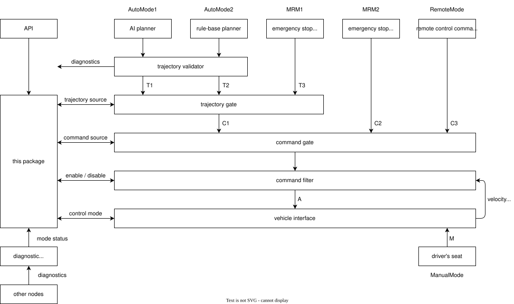
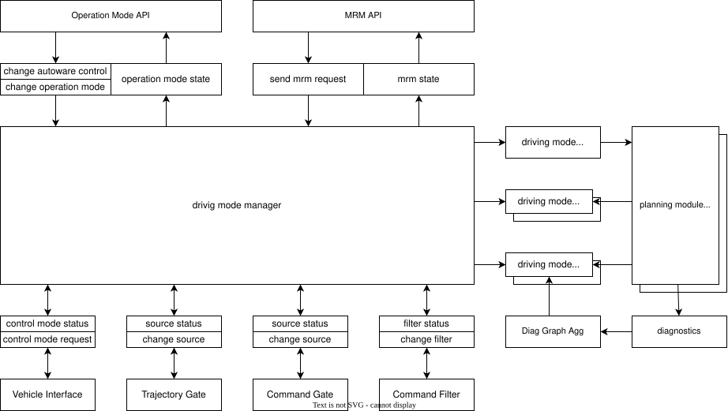
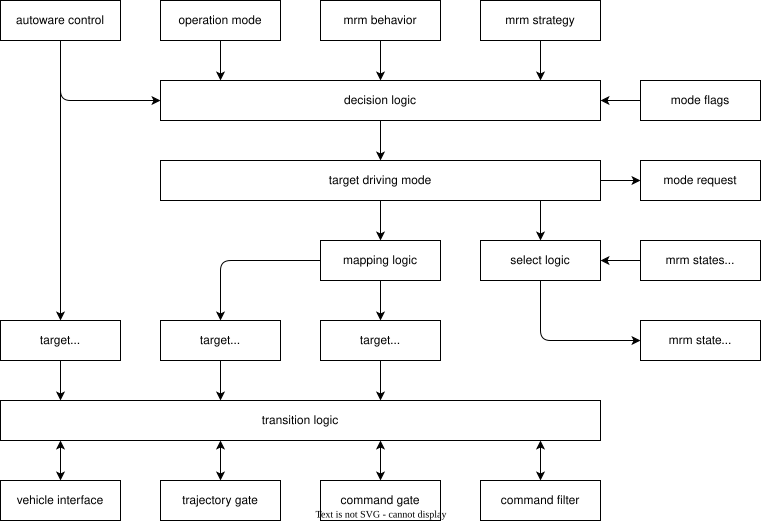
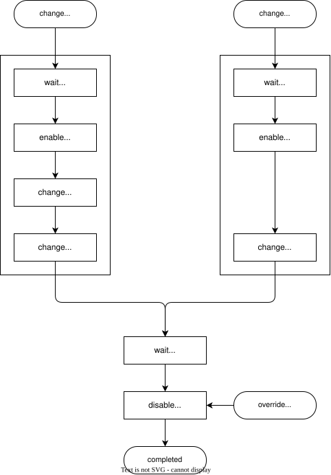

# autoware_driving_mode_manager

## Overview

Autoware performs different behaviors depending on the API and the diagnostics.
Each behavior outputs either a trajectory or a command, and they are selected by the trajectory gate and command gate as shown below.
This package checks the current state of Autoware and controls the relevant nodes to perform appropriate behavior.

## Driving Mode

In this package, each behavior of a vehicle is referred to as a driving mode.
The driving modes are divided into autoware mode, which is under the control of Autoware, and platform mode, which is under the control of the vehicle platform.
This is because platform mode can only be controlled via vehicle hardware and cannot be controlled by software, or it may be changed by override.

Autoware mode is implemented by switching between trajectory and command.
Therefore, this package manages the correspondence between the driving mode and the trajectory/command source.
For example, the correspondence would be as shown in the table below.

<table>
<tr><th rowspan="2">Driving Mode</th><th colspan="2">Autoware Mode</th><th>Platform Mode</th></tr>
<tr><th>Trajectory Source</th><th>Command Source</th><th>Control Mode</th></tr>
<tr><td>AutoMode1</td> <td>T1</td><td>C1</td><td>A</td></tr>
<tr><td>AutoMode2</td> <td>T2</td><td>C1</td><td>A</td></tr>
<tr><td>MRM1</td>      <td>T3</td><td>C1</td><td>A</td></tr>
<tr><td>MRM2</td>      <td>any</td><td>C2</td><td>A</td></tr>
<tr><td>RemoteMode</td><td>any</td><td>C3</td><td>A</td></tr>
<tr><td>ManualMode</td><td>any</td><td>any</td><td>M</td></tr>
</table>

## Operation Mode and Fail-safe API

The operation mode API and Fail-safe API define their own IDs for modes.
Since driving mode integrates these modes, conversion from API IDs is required.

| API            | ID  | Driving Mode ID | Description     |
| -------------- | --- | --------------- | --------------- |
| Operation Mode | 1   | 1001            | StopMode        |
| Operation Mode | 2   | 1002            | AutonomousMode  |
| Operation Mode | 3   | 1003            | LocalMode       |
| Operation Mode | 4   | 1004            | RemoteMode      |
| Fail-safe      | 2   | 2001            | EmergencyStop   |
| Fail-safe      | 3   | 2002            | ComfortableStop |

## Related Nodes

The driving mode manager assumes that there is an external module that outputs a trajectory or command.
Furthermore, each module must implement the necessary interfaces for driving mode, including the driving mode request, flags, and mrm state.
Additionally, source interface for switching trajectory and command, filter interface for smoothing commands during the switch, and control mode interface are also required.

## Drive Mode Flags

| Flags       | Description                                                                                             |
| ----------- | ------------------------------------------------------------------------------------------------------- |
| available   | Whether it is possible to switch to the mode. This does not guarantee that output is actually produced. |
| ready       | Whether the mode output is actually being produced.                                                     |
| stable      | Whether the mode operation is stable and the transition can be completed.                               |
| continuable | Whether the vehicle is currently driving in the mode and can continue to do so.                         |

## Implementation

The decision logic continuously updates the target autoware mode.
This logic refers to the driving mode flags, so if the mode specified in the API is unavailable, MRM will be selected.
Next, the mapping logic updates the trajectory source and command source corresponding to the selected autoware mode,
and then the transition logic operates the gate node and vehicle interface.

## Mode Transition

When the autoware mode changes, the following steps are used to switch modes.
Switching to a state where Autoware control is not applied is performed immediately.
Switching to a state where Autoware control is applied uses the following steps.
If additional conditions are required while driving, include them in available status.

