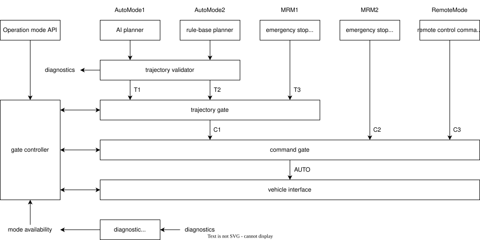
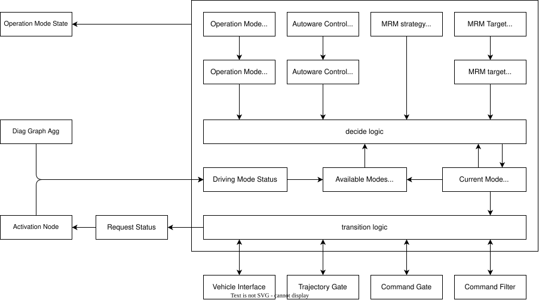

# autoware_system_mode_decider

## Overview

AutowareはAPIからの要求や自己診断の状態に応じて様々な挙動を実行します。
各挙動はそれぞれtrajectoryまたはcommandを出力としており、これらが以下の図のようにtrajectory gateとcommand gateにより選択されます。
このパッケージではこれらの

## Driving Mode

ここではAutowareが取りうる挙動をDriving Modeと呼んで区別し、各ゲートへの入力もtrajectory sourceとcommand sourceと呼ぶことにします。
また、車両インターフェースは状態としてControl Modeを持っており、これによってAutowareからの出力が反映されるか決まります。
このとき、Driving Modeは以下の表のようなtrajectory sourceとcommand sourceとControl Modeの組み合わせに対応します。

実際にはControl ModeはAutowareから制御できなかったり、オーバーライドにより変化することがあるので分けて扱います。
Driving Modeの中でAutowareの制御下にあるものをAutoware Mode、それ以外をPlatform Modeと呼ぶことにします。

<table>
<tr><th rowspan="2">Driving Mode</th><th colspan="2">Autoware Mode</th><th>Platform Mode</th></tr>
<tr><th>Trajectory Source</th><th>Command Source</th><th>Control Mode</th></tr>
<tr><td>AutoMode1</td> <td>T1</td><td>C1</td><td>A</td></tr>
<tr><td>AutoMode2</td> <td>T2</td><td>C1</td><td>A</td></tr>
<tr><td>MRM1</td>      <td>T3</td><td>C1</td><td>A</td></tr>
<tr><td>MRM2</td>      <td>any</td><td>C2</td><td>A</td></tr>
<tr><td>RemoteMode</td><td>any</td><td>C3</td><td>A</td></tr>
<tr><td>ManualMode</td><td>any</td><td>any</td><td>M</td></tr>
</table>

## Operation Mode and Fail-safe API

また、operation mode API や Fail-safe API はモードについて独自のIDを定義しています。
Driving Modeはこれらのモードを統合して扱うため、APIのIDから変換する必要があります。

| API            | ID  | Driving Mode ID | Description     |
| -------------- | --- | --------------- | --------------- |
| Operation Mode | 1   | 1001            | StopMode        |
| Operation Mode | 2   | 1002            | AutonomousMode  |
| Operation Mode | 3   | 1003            | LocalMode       |
| Operation Mode | 4   | 1004            | RemoteMode      |
| Fail-safe      | 2   | 2001            | EmergencyStop   |
| Fail-safe      | 3   | 2002            | ComfortableStop |

## Implementation Overview

## Drive Mode Status

| Flags       | Description                                                                        |
| ----------- | ---------------------------------------------------------------------------------- |
| available   | 該当モードに切り替えられる状態になっているか。実際に出力が行われている保証はない。 |
| ready       | 該当モードの出力が実際に行われている状態になっているか。                           |
| stable      | 該当モードの動作が安定し遷移を完了できる状態になっているか。                       |
| continuable | 該当モードで現在走行しており、今後も動作を継続できる状態になっているか。           |

## Autoware Mode Transition

Autoware Modeが変更された場合、以下の処理によりモードの切り替えを行います。

1. コマンドフィルターを有効化する。
2. 現在のmodeのreadyを待つ
3. Trajectory Sourceを切り替える
4. Command Sourceを切り替える。
5. 現在のmodeのstableを待つ
6. コマンドフィルターを無効化する。

## Platform mode Transition

Autowareの制御が反映されない状態へ切り替える場合は直ちに実行されます。
Autowareの制御が反映される状態へ切り替える場合は以下の処理が行われます。
走行中には追加の条件を必要する場合は available に含めてください。

1. コマンドフィルターを有効化する。
2. 現在のmodeのreadyを待つ
3. Control Modeを切り替える
4. 現在のmodeのstableを待つ
5. コマンドフィルターを無効化する。
